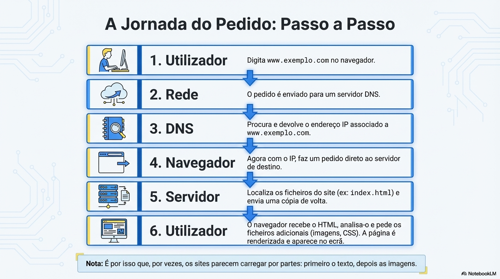

# Como a internet funciona?

## Tudo começa com o sinal

O computador é uma máquina capaz de processar apenas **ondas elétricas binárias (0 e 1), chamadas de bits**. O agrupamento de **8 bits forma um Byte**, a porção mínima para representar uma informação, como uma letra.

## Como nos conectamos com outros pontos de rede?

Os pacotes de dados viajam entre continentes, **através de cabos de fibra ótica submarinos** que se interligam a outros sistemas de comunicação, como linhas telefônicas. Para a conversão dos sinais diferentes utiliza-se o Modem, que realiza a **modulação (conversão de ondas digitais em analógicas) e a demodulação (processo inverso)**. 

## Como acessamos servidores?

Quando acessamos um site **através de seu domínio**, atuamos como **cliente** solicitanto dados. O navegador consulta um **servidor DNS** (Sistema de Nomes de Domínio) que possui o endereço IP do site, **traduzindo o domínio digitado (como google.com) no endereço IP real do servidor** e retornando os arquivos em pequenos pacotes.

