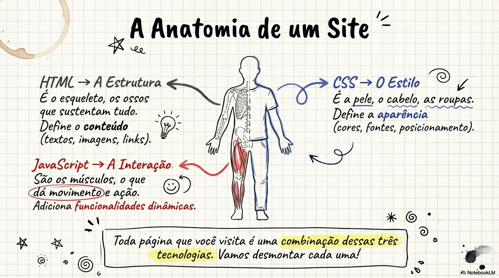

# Como funciona a HTML e as CSS?

Um servidor retorna uma cópia de documentos HTML, CSS e JavaScript através da solicitação cliente-servidor.
O navegador analisa as linhas de código e gera um resultado visual (o site em si).


## HTML (HyperText Markup Language)

É uma ferramenta para **estruturar o conteúdo de uma página**. Seu foco principal é o conteúdo, como ***textos, títulos, imagens, vídeos, links, listas e tabelas.***


### Conteúdo em HTML

Ela funciona baseada em marcações chamadas **tags (ou etiquetas)**, que geralmente vêm em pares: **uma de abertura e uma de fechamento (identificada por uma barra)**.

```html
Exemplo de Anatomia: <tag parâmetro="valor">Conteúdo</tag>

Ex1: <h1>Exemplo de título</h1>
Ex2: <p>Exemplo de parágrafo</p>
Ex3: 
```


### Estrutura básica de documento HTML

Todo arquivo HTML começa com uma estrutura padrão que inclui a declaração `<!DOCTYPE html>` para indicar a versão do html, seguida pelas tags `<html>`, `<head>` (para "metadados") e `<body>` (onde o conteúdo visível aparece).

```html
<!DOCTYPE html>
<html lang="pt-br">
    <head>
        <meta charset="UTF-8">
        <meta name="viewport" content="width=device-width, initial-scale=1.0">
        <title>Document</title>
    </head>
    <body>
        <h1>Olá, Mundo!</h1>
    </body>
<html>
```


## CSS (Cascading Style Sheets)

São usadas para configurar o **resultado visual dos elementos** criados no HTML. Seu foco é o design e estilo, definindo ***cores, fontes, tamanhos, posicionamento e organização.***


### Estilos em CSS

Diferente do HTML, as CSS funcionam baseadas em **seletores**, **propriedades** e **valores**.

- O seletor **indica qual elemento HTML será estilizado** e as declarações dentro das chaves `{}` definem as mudanças visuais, *sempre terminando com ponto e vírgula*.

```css

Exemplo de Anatomia:

h1 {
    font-family: Arial;
    font-size: 20pt;
    color: blue;
}

seletor {declaração} -> propriedade: valor;

```


## JavaScript (JS)

O JavaScript é, de fato, uma **Linguagem de Programação**. Seu foco é na **interatividade** e comportamento dinâmico, permitindo criar ***menus, animações, popups, validações, etc.***

- **Estrutura:** O código JavaScript envolve estruturas como **variáveis** (para guardar dados), **condições** (testes lógicos), **laços** (repetições), **funções e objeto**s.

- **Implementação:** Os scripts podem ser escritos dentro do documento HTML, entre as tags `<script>` e `</script>`, ou em arquivos com a extensão `.js`.


